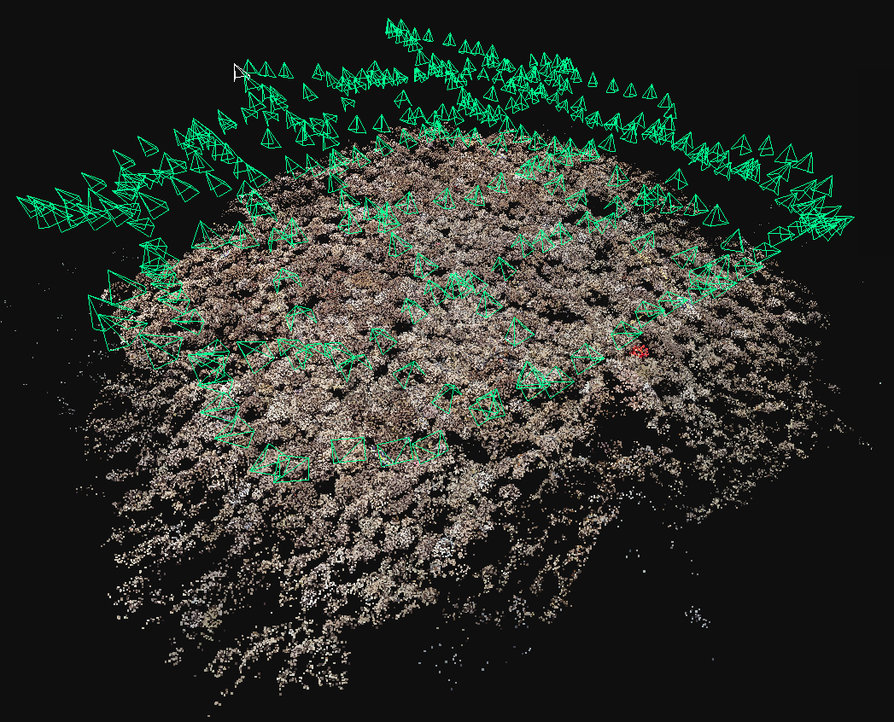

Method
---------------

## Feature Matching
The SIFT is modified as RootSIFT.
The installation of AdaLAM follows [AdaLAM](https://github.com/cavalli1234/AdaLAM).

## Reconstruction
The 3D reconstruction is based on [OpenDroneMap](https://opendronemap.org/). It is a program that runs in the command line.

Here is an example:
```bash
run PATH_TO_PROJECT --gcp PATH_TO_GCPFIEL --dsm
```

The orthophotos/DOMs and DSMs can be downloaded from [here](https://drive.google.com/drive/folders/18vh2BUHEDRaTmuHEKyhz3XT1_jmJSWPg?usp=sharing).


