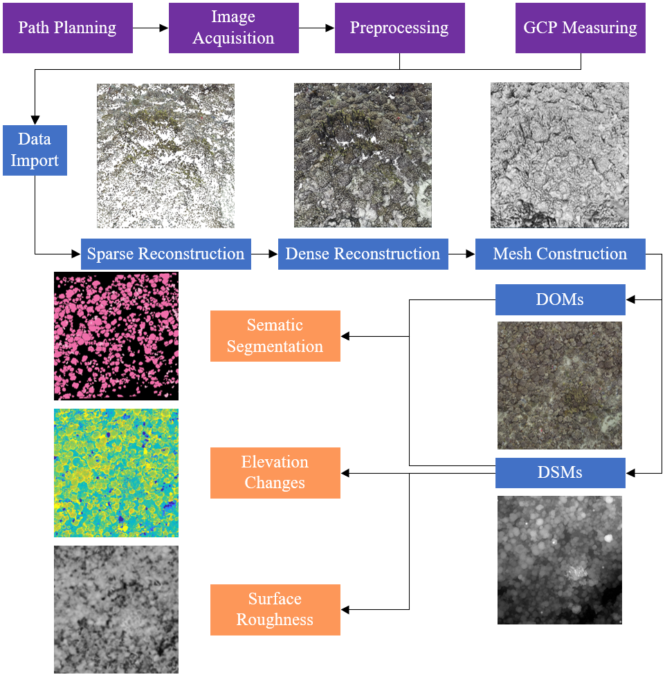

# Coral-3D-Analysis-Toolbox
A toolbox to analyse coral reefs in 3D perspective. This may be the first approach to combine photogrammetry and semantic segmentation on coral reef analysis.

## Introduction
This toolbox currently includes the following functions:
* Photogrammetry
  - SIFT feature extraction and AdaLAM.
  - OpenDroneMap
* Segmentation
  - DeepLabv3+
  - MMCS-Net(Multi-Modal Coral Segmentation Network) for coral semantic segmentation.

## Overview

## Result

## Demo

## Note
If you have any questions, please feel free to contact us.
