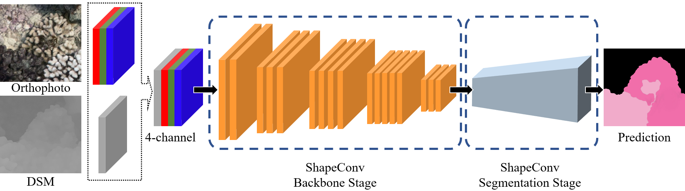
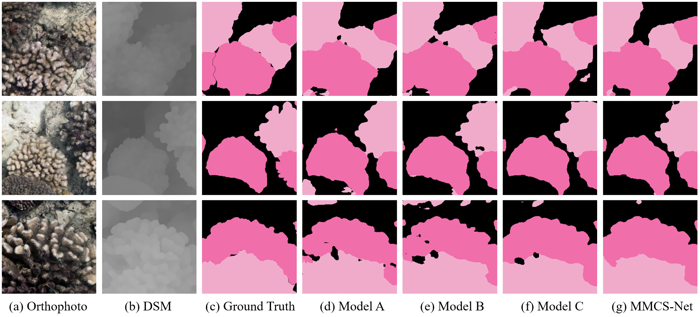

# MMCS-Net
This repo holds code for [Combining Photogrammetric Computer Vision and Semantic Segmentation for Fine-grained Understanding of Coral Reef Growth Variations]

## Usage

### 1. Preparation

Please go to ["./datasets/plot18_2019/README.md"](./dataset/plot18_2019/README.md) for details.

Please go to ["./utils/mypath.py] to modify the path.

### 2. Environment

Please prepare an environment with python=3.7, and then use the command "pip install -r requirements.txt" for the dependencies.

### 3. Train/Test
- Run the train script on coral dataset. The data is the excerpt of the whole dataset, 

```bash
python train.py --dataset plot18_2019 --backbone resnet_rgbd --use_balanced_weights --kfoldval True
```

A sampled dataset can be downloaded from [here](https://drive.google.com/file/d/1T6cV43Uo5k5UbqJegOfwvHL-3MM0VEE8/view?usp=sharing).

## Model
MMCS-Net


## Description
To generate the dataset for training, the orthophoto is clipped into a set of patches, each of which is extracted from a sliding window swiped over the whole tile at a stride of 224 pixels. This approach guarantees that all pixels at the edge of a patch become central pixels in subsequent patches，as Diakogiannis did Remote Sensing Image Segmentation  in 2020[1]. 

## Result

* Model A - DeepLabv3+
* Model B - DeepLabv3+ (RGB-D)
* Model C - DeepLabv3+ (ShapeConv)


## Reference
1. Diakogiannis, F. I., Waldner, F., Caccetta, P., & Wu, C. (2020). ResUNet-a: A deep learning framework for semantic segmentation of remotely sensed data. ISPRS Journal of Photogrammetry and Remote Sensing, 162, 94-114.
1. [Deeplab V3+](https://github.com/jfzhang95/pytorch-deeplab-xception)
